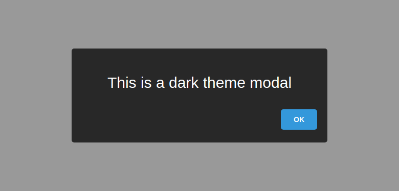

<h1 align='center'>Coolmodal</h1>
<p align='center'>
<i>A cool, elegant modal creator for lazy developers</i>
</p>

## About
This library will help creating beautiful modals that can also have form on it.

## Documentation
Check out the documentation [here](docs/api.md).

## Installation

First download this library using the command:

```
npm install coolmodal
```

Or download the coolmodal.min.js file in the releases pages:<br>
https://github.com/ZeroX-DG/coolmodal/releases/

And include it in your html file using script tag
```html
<script src='path/to/coolmodal.min.js'></script>
```

## Basic usage

On nodejs you can require and call `coolmodal` like this
```js
const coolmodal = require('coolmodal');
coolmodal({title: 'Hey'});
```

Or if you're on browser, you can just call `coolmodal` function like this:
```js
coolmodal({title: 'Hey'});
```
The result:
<p align="center">
  
</p>

## Examples

### Modal with form

To use with form, you can add a `content` option to specify the form content. Also, there is the `button` option where you can add button to your modal with 4 different types: success, danger, warning, info and 2 different actions: submit and dismiss. When the button action is submit, the `onSubmit` event will be called and the value in the form will be sent to the event callback.

You can specify the callback using the second parameter which is an object containing functions with the name matched the event name.

```js
coolmodal({
  title: 'This is a form',
  content: [
    {tag: 'input', name: 'name', placeholder: 'enter name...', label: 'Name:'}
  ],
  button: [
    {
      content: 'Show my name',
      action: coolmodal.BUTTON_SUBMIT
    },
    {
      content: 'Dont show !',
      action: coolmodal.BUTTON_DISMISS,
      type: coolmodal.BUTTON_DANGER
    }
  ]
},{
  onSubmit(values) {
    coolmodal({title: values.name});
  }
});
```

And the result:

<p align="center">
  
</p>

### Modal with theme
coolmodal is now supported themes. If you want to add your theme, then don't hesitate to send me an PR of your theme.

```js
coolmodal({
  title: 'This is a dark theme modal',
  theme: 'dark'
});
```

Result:
<p align="center">
  
</p>

## Contact
Facebook: https://fb.com/ZeroXCEH<br>
Twitter: https://twitter.com/ZeroX_Hung<br>
Email: viethungax@gmail.com
